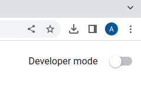

# Hindi Readability

## To install the Extension
1. Install Google Chrome if not installed already.
2. On the address bar of Chrome type `chrome://extensions/` and hit enter.
3. Toggle the initially turned off `Developer mode` switch present on the top right corner as shown below.    
   
4. As soon as we turn on the Developer mode we get the options as shown below.
  
Click on Load unpacked and select the extension directory.  
5. We now have the extension installed. We can verify it by clicking the extensions button.  

## To test the extension
1. We have a `sample.html` file containing Hindi text. Load it in Chrome.
2. We can click on the extension to get the readibility score.  

3. For the sample file we get the score as  

